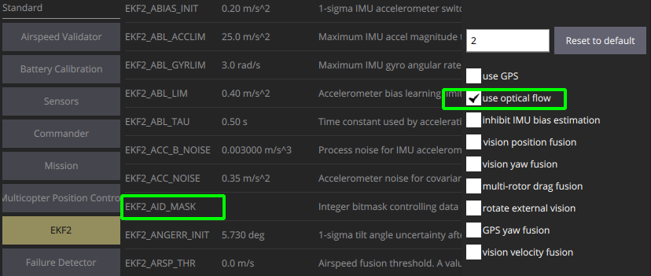

# Инструкция по выполнению Модуля 6

Вы готовы приступить к практике модуля 6 и сможете научить беспилотник летать при помощи систем технического зрения.

## Введение
<a name="введение"></a>

В современной робототехнике часто применяют навигацию на основе технического зрения, так как необходимы точное позиционирование и автономность, а в некоторых задачах невозможно использовать ГНСС. В сфере автономных БЛА она позволяет создавать навигационные поля для полёта в помещении, реализовать высокоточные системы посадки, построить карты окружающего пространства, систем облёта препятствий и прочего.


В качестве основы для обработки изображений мы будем использовать библиотеку OpenCV с широким функционалом.

При желании работать из под любой ОС с использованием Docker, ознакомитесь с. 


Если вы планируете работать в любой ОС и использовать Docker, ознакомьтесь с  [инструкцией](docs/docker_usage.md). Для работы вне контейнера необходимо установить библиотеку OpenCV и другие зависимости. [Инструкция по установке OpenCV](docs/dependances_install.md).


## Практическая работа.

В видео вы уже рассматривали основной принцип работы навигационных систем, поэтому теперь вам необходимо разработать собственную программу для навигации БЛА в системе имитационного моделирования. В этой практической работе вы можете выбрать одно из двух заданий:


- `Первый Вариант`: создать навигационную систему с технологией реперных маркеров;

- `Второй вариант`: разработать навигационную систему на основе технологии оптического потока.

Для каждого варианта можно ознакомиться с подробной инструкцией по выполнению.
Перед практикой мы рекомендуем изучить [тему по системам визуальной навигации](docs/visual_navigation_basics.md).


1) [Инструкция по созданию навигационной системы БЛА с использованием оптического потока.](docs/optical_flow.md)

2) [Инструкция по созданию навигационной системы БЛА с использованием технологии реперных маркеров.](docs/fiducial_navigation.md)


## Работа с системой имитационного моделирования

Для практической работы мы рекомендуем загрузить архив с рабочей папкой проекта и распаковать его в ваше рабочее пространство для ros, например в папку `~/catkin_ws/src` (по аналогии с модулем 5). В архив входят sh-скрипты для запуска и остановки симулятора (в папке scripts), модели окружающей среды .world и модели реперных маркеров.


<p align="center">
    <strong>Источник: </strong> Михаил Колодочка
</p>


### Переменные окружения

Чтобы запустить симулятор, нужно проинициализировать все необходимые переменные.

Экспорт переменных окружения ROS:

```bash
source /opt/ros/noetic/setup.bash
```

Экспорт переменных окружения Px4:

```bash
source <ваш_путь>/PX4-Autopilot/Tools/setup_gazebo.bash \
<ваш_путь>/PX4-Autopilot <ваш_путь>/PX4-Autopilot/build/px4_sitl_default
export ROS_PACKAGE_PATH=$ROS_PACKAGE_PATH:/PX4-Autopilot:<ваш_путь>/PX4-Autopilot/Tools/sitl_gazebo
```

Обращаем внимание на необходимость установки `<ваш_путь>`, в зависимости от
Обращаем внимание на необходимость установки `<ваш_путь>`, в зависимости от
положения папки `PX4-Autopilot`. Например если полный путь к папке выглядит так:
`/home/my_username/PX4-Autopilot`, то `<ваш_путь>` **=** `/home/my_username/PX4-Autopilot`

```bash
export GAZEBO_MODEL_PATH=/app/sim/models:/PX4-Autopilot/Tools/sitl_gazebo/models
```
### Запуск симулятора

Для запуска симулятора c моделью БЛА воспользуемся следующим скриптом:


```bash
./scripts/start_sim.sh
```

Остановить его можно при помощи скрипта:

```bash
./scripts/stop_sim.sh.
```


## Конфигурация параметров автопилота

Чтобы создать навигационные системы при помощи технического зрения,
в автопилоте PX4 можно использовать внешнюю оценку положения и ориентации автопилота.
Для этого в настройках фильтра нужно установить соответствующие флаги.


### Конфигурация для навигации по реперным маркерам

<p align="center">
    <strong>Источник: </strong> Михаил Колодочка
</p>


### Конфигурация для навигации по оптическому потоку

<p align="center">
    <strong>Источник: </strong> Михаил Колодочка
</p>


Чтобы алгоритм оптимального оценивания работал корректно, необходимо установить значения среднеквадратического отклонения (СКО) для измерений положения и ориентации вашей навигационной системы. В PX4 чаще всего используют квазилинейный фильтр калмана — EKF.


<p align="center">
    <strong>Источник: </strong> Михаил Колодочка
</p>


Также стоит указать задержку между измерениями визуальной навигационной системы и измерениями ИНС.


<p align="center">
    <strong>Источник: </strong> Михаил Колодочка
</p>

**Важно:** от точности СКО навигационной системы зависит точность оптимальной оценки фильтра.
В практической работе вам необходимо настроить эти параметры самостоятельно.

Для работы оптического потока в заданном диапазоне высот, требуется
изменить параметры **SENS_FLOW_MAXHGT и SENS_FLOW_MINHGT**.


## Рекомендации по выполнению задания

При выполнении практической работы используйте конфигурацию ЛА для удержания положения ПО ГНСС (летать со стандартными настройками). При полёте по ГНСС вы можете испытать собственную систему, посмотреть точность и корректность определения положения и ориентации ЛА.
Проверив корректность работы системы, нужно загрузить параметры для варианта вашей навигационной системы и продолжить испытания. Обратите внимание, что топик **/mavros/local_position/pose** публикует сообщения.
Если сообщения заполнены или отправлены неверно, данные не опубликуются.


### Рекомендуемая программа испытаний

1. Взлёт аппарата
   
   Его можно выполнить при помощи графического интерфейса QgroundControl, опубликовав желаемое положение в ваш топик по модулю 5. Если взлёт проходит штатно и аппарат стабилизируется относительно заданного положения над точкой взлёта, можно переходить к следующему пункту. Если есть недочёты, проверьте, что данные преобразованы правильно. Чаще всего ошибки происходят, если шаг интегрирования для системы оптического потока указан неверно или система координат (СК) камеры некорректно преобразована в связную СК. 
   
   Для оптического потока проверьте направление (знаки «+» или «−») и порядок осей (X и Y) при передаче сообщения. При помощи утилиты MAVLink Inspector в QGroundControl убедитесь, что автопилот получает данные с дальномера и сообщения. Для реперных маркеров необходимо проверить, корректно ли вектор положения и ориентации переходит от CК реперных маркеров к СК камеры и СК, связанной с аппаратом. Часто ошибка может быть в угловом положении, даже если положение определено верно. Проверьте положение СК маркеров при взлёте, они должны практически совпадать с начальными условиями, заданными при нахождении аппарата на земле. В противном случае оценка фильтра не будет сходиться с оценкой ориентации угла рысканья по реперным маркерам и аппарат упадёт. Также важно, чтобы калибровка камеры была точной, а истинный размер реперных маркеров соответствовал заданному.


2. **Полёт аппарата по заданной траектории**

   Необходимо запустить программу управления полётом по окружности для вашей навигационной системы. Вы разбирали её в модуле 5. Важно убедиться, что аппарат действительно движется по окружности. Скорость движения и радиус окружности можно менять по усмотрению. При этом ошибки чаще всего возникают, если частоты работы навигационной системы недостаточно или аппарат выходит за пределы навигационного поля, например теряя реперные маркеры (ориентиры). Также процесс усложняет слишком большая высота: по мере уменьшения ориентира снижается точность определения в поле зрения системы. Ведь изображение состоит из пикселей; чем больше пикселей занимает маркер, тем точнее можно узнать его положение в СК камеры. Аналогично и для оптического потока: чем больше высота, тем менее точно можно определить смещение кадров, особенно если объекты в поле зрения системы сравнительно небольшие.


3. **Посадка**

   Необходимо выполнить посадку аппарата. Если предыдущие пункты выполнены верно, ошибка в этом пункте маловероятна.
