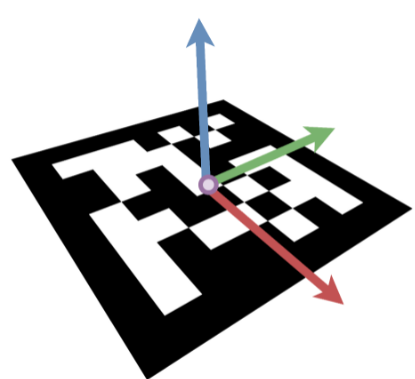
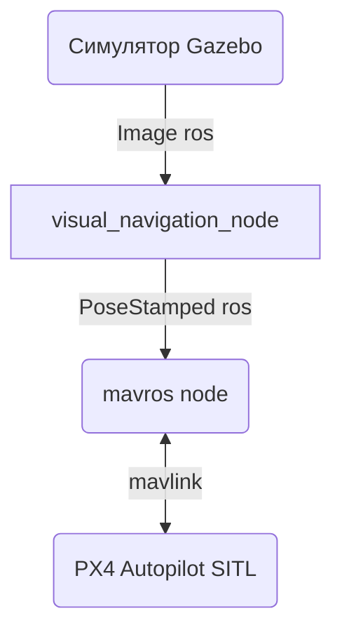
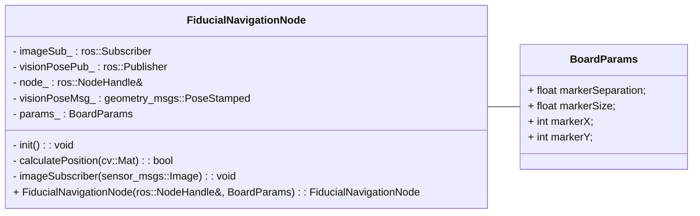

# Создание навигационной системы БЛА с использованием реперных маркеров

    <strong>Источник: </strong> Михаил Колодочка

Если систему позиционирования ЛА создают при помощи оптического потока, рассматривают следующие СК: связная СК (body frame), СК камеры (camera frame), СК реперного маркера или массива реперных маркеров (fiducial frame).

---

Примеры создания и использования поля реперных маркеров были рассмотрены нами в [материале](visual_navigation_basics.md). Поэтому при необходимости рекомендуем ознакомиться с ними.

---

### Передача данных в автопилот

Когда сторонняя навигационная система, например с реперными маркерами на борту, получает данные о положении, то отправляет их в топик **/mavros/vision_pose/pose** в формате сообщений
**geometry_msgs/PoseStamped** или **geometry_msgs/PoseWithCovarianceStamped**.
В таком сообщении, помимо вектора положения и кватерниона ориентации, указана ковариационная матрица размерности 6 × 6 положения и углов ориентации. Мы задали дисперсию для реперных маркеров через константу в конфигураторе. Также можно добавить расчёт СКО навигационной системы, если это позволяют размеры области изображения, занимаемого реперным маркером. 

Чем меньше пикселей приходится на реперный маркер, тем больше СКО определения положения и ориентации.

Вы уже знакомы со структурой таких сообщений по модулю 5. Передавая сообщения, присваивайте метку времени к заголовку сообщения header.stamp. Без неё автопилот не сможет использовать визуальную навигацию.

---
### Примечание

Сначала реперные маркеры не будут в поле зрения, так как камера расположена близко к земле.

Так как фильтру Калмана необходим постоянный поток данных, важно передавать последнее увиденное значение или нули для X и Y (0,0), если маркер не появился в поле зрения.я.

---

### Предлагаемая архитектура программы

    <strong>Источник: </strong> Михаил Колодочка

    <strong>Источник: </strong> Михаил Колодочка

### Вычислительный алгоритм

1) Получение изображения.

2) Поиск реперных маркеров.

3) Определение положения и ориентации.

4) Перевод из СК камеры в СК маркера и от камеры в связную СК.

5) Отправка данных на автопилот.
