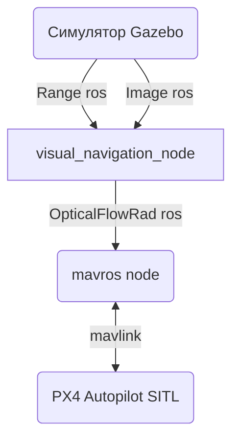
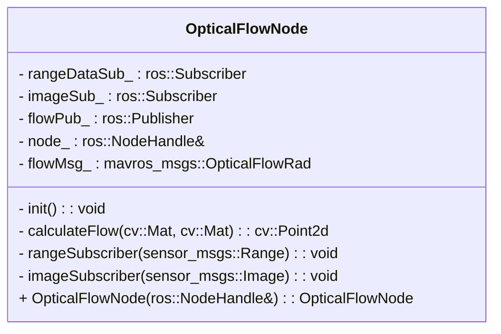
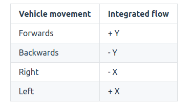

# Создание навигационной системы БЛА с использованием оптического потока.

## Методы вычисления оптического потока

Оптический поток можно вычислять по-разному. Наиболее популярны методы Лукаса-Канаде (далее ЛК) с использованием пирамиды Лапласа, фазовые и классические корреляционные алгоритмы.

Метод ЛК рассматривает смещение характерных точек (или областей) между двумя кадрами. Чтобы найти на изображении характерные точки, необходимо много вычислительных ресурсов, которых недостаточно на борту. Поэтому метод ЛК часто заменяют более простыми, но менее точными и устойчивыми способами фазовой или классической корреляции.

При работе метода ЛК можно получить смещение для каждой характерной точки или области. Аналогичный процесс вы рассматривали в примере с оптическим потоком с классическими корреляционными алгоритмами.

Смещение в пикселях между кадрами вызывает дисторсию, поэтому его необходимо преобразовать при помощи матрицы камеры и матрицы дисторсии, полученной при калибровке камеры. В системе имитационного моделирования параметры оптического центра, точки фокуса, тангенциальной и радиальной дисторсии заранее известны. Их можно задать в модели камеры. Параметры модели камеры можно установить в файле 
[sim/models/navigation_cam/navigation_cam.sdf](..//sim/models/navigation_cam/navigation_cam.sdf). 

Этот пересчёт не нужен в задании, так как в базовой конфигурации модели нет дисторсии. В рассмотренных примерах мы тоже не учитывали дисторсию, потому что её значения на камере были слишком маленькими.


---

Во вспомогательном [материале](visual_navigation_basics.md). вы можете найти примеры применения OpenCV и ознакомиться с основами OpenCV.

---

## Системы координат

Когда систему позиционирования ЛА создают при помощи оптического потока, рассматривают следующие СК: связная СК (body frame), СК камеры (camera frame), связная нормальная СК (body normal frame), СК дальномера (range sensor frame). Результат вычисления оптического потока, а именно смещение между кадрами на текущей и прошлой итерации, относят к системе координат камеры, поэтому необходимо задать положение системы оптического потока относительно центра связной СК в конфигураторе.

Также стоит учесть положение дальномера относительно связной СК ЛА. Передавая измерения датчика на борт ЛА, необходимо перевести их в связную СК. Чтобы найти расстояние до земли в автопилоте PX4, не нужно рассчитывать вертикальную проекцию измерений дальномера. За это отвечает программное обеспечением самого автопилота.


## Передача данных в автопилот

Если вы используете оптический поток для навигации автопилота PX4, не нужно отправлять сообщения по протоколу MAVLink на борт автопилота. Мы рекомендуем использовать пакет MAVROS. 

Когда данные приходят в топик `/mavros/px4flow/raw/send`, MAVROS конвертирует сообщение типа `mavros_msgs::OpticalFlowRad` в сообщения для протокола MAVLink и передаёт их автопилоту БЛА.

Рассмотрим структуру сообщения:

- [описание типов данных и структуры mavros_msgs/OpticalFlowRad пакета
  mavros_extras.](http://docs.ros.org/en/api/mavros_msgs/html/msg/OpticalFlowRad.html)

- ```integration_time_us``` — временной шаг определения оптического потока (время
  между текущей и предыдущей оценкой оптического потока) в микросекундах ($1$
   сек $ = 10^6$ микросекунд)

- ```integrated_x``` — смещение кадра по оси X однородной СК камеры в радианах;

- ```integrated_y``` — смещение кадра по оси Y однородной СК камеры в радианах.

_Примечание_: поле называют integrated. При вычислениях смещение между кадрами переводят в метры и получают расстояние, которое ЛА пролетел за время dt между кадрами. Чтобы определить, какое расстояние прошёл ЛА, смещение суммируют (интегрируют) и получают оценку положения. Со временем в такой оценке появляется ошибка из-за дискретизации данных в виде пикселей, ошибок алгоритма вычисления оптического потока, интегрирования и измерения дальномера, неоднородности высоты подстилающей поверхности и прочего. Аналогично возникают ошибки БИНС. Но, в отличие от инерциальной НС в малых БЛА, навигация с оптическим потоком накапливает ошибку медленнее. При этом частота её работы невысока и сопоставима с частотой работы камеры (как правило, от 10 до 120 Гц).

Поля ниже соответствуют мгновенной угловой скорости ЛА. Система использует их, чтобы компенсировать составляющую оптического потока, которая возникает из-за вращения ЛА вокруг осей связной нормальной СК.
```
integrated_xgyro
integrated_ygyro
integrated_zgyro
```


_Примечание_:  камера связана с аппаратом, поэтому изображение меняется при вращении БЛА, например в канале тангажа при полёте вперёд. Так как важна только линейная составляющая, вращательную нужно компенсировать. В этом поможет мгновенная угловая скорость аппарата, которую можно получить при помощи гироскопа. Автопилот компенсирует всё самостоятельно. Необходимо лишь заполнить и отправить сообщение `OpticalFlowRad`.

`temperature` — температура датчика оптического потока. Этот параметр характеризует температуру ИНС, которая даёт угловую скорость. В большинстве МЭМС температура датчика существенно влияет на точность измерений.


`quality` — характеристика точности системы оптического потока (0–255). Она зависит от функции отклика системы оптического потока (для фазовой корреляции) и от количества характерных точек для дифференциальных методов.


_Примечание_: один из ключевых факторов, который влияет на точность оптического потока, — неоднородность поверхности в поле зрения камеры. Чем больше информативных признаков, тем лучше алгоритмы оптического потока определяют смещение. Тем не менее система может неверно определить смещение, если на изображении много периодических высокочастотных объектов. Например, изображения мелких камней на поверхности асфальта слишком похожи друг на друга. 

В качестве примера можно рассмотреть оптическую компьютерную мышь, которая плохо работает на однородных поверхностях, например на глянцевом белом столе. При этом она будет хорошо работать на специальном коврике с картинкой. 
У метода `flow, resp = cv2.phaseCorrelate(prev_frame_gray, current_frame_gray)`,
возвращаемое значение `resp` как раз и может быть характеристикой качества.
Можно рассчитать так `quality = int(resp * 255)`, потому что $resp \in (0, 1)$

`time_delta_distance_us` — временной шаг определения расстояния дальномера
(время между измерениями датчика) в микросекундах ($1$
   сек $ = 10^6$ микросекунд).

Для адекватной работы оптического потока, в автопилоте PX4, необходимо передавать метку времени в шапку
сообщения, например следующим образом:

```c++
// opticalFlowMsg - экземпляр класса сообщения типа mavros_msgs::OpticalFlowRad
opticalFlowMsg.header.stamp = ros::Time::now()
```

`distance` — измерения датчика расстояния (дальномера).


Важно учитывать, что автопилот принимает на вход величину в **радианах**, а не в пиксельном смещении. Это позволяет перейти от зависимости разрешения и углов обзора камеры к унифицированному расчёту в радианах. Так алгоритм оптического потока универсален и независим от параметров камеры. Рассмотрим пример кода с преобразованием **пиксельного смещения** в **радианы** перед отправкой сообщения:


```c++
// pixel_shift_x, pixel_shift_y - переменные пиксельного сдвига,
// получаемые при работе алгоритма оптического потока

// resolution_x, resolution_y - константы характеризующие пиксельное разрешение изображения(width, height)
// fov_x, fov_y - константы характеризующие поле зрения камеры FOV(field of view)

double shift_x_rad = (pixel_shift_x / resolution_x) * fov_x;
double shift_y_rad = (pixel_shift_y / resolution_y) * fov_y;
// Переводим в систему координат для PX4
opticalFlowMsg.integrated_x = -shift_y_rad;
opticalFlowMsg.integrated_y = -shift_x_rad;
```

## Предлагаемая архитектура программы


<p align="center">
    <strong>Источник: </strong> Михаил Колодочка
</p>

Рассмотрим пример диаграммы для класса, который вычисляет оптический поток и отправляет сообщения на борт автопилота через MAVROS.


<p align="center">
    <strong>Источник: </strong> Михаил Колодочка
</p>

В рамках выполнения данного задания рекомендуется
использовать за основу приведенные выше диаграммы.


## Вычислительный алгоритм


1) Получение изображения с камеры.

2) Преобразование изображения и нахождение оптического потока.
   Сохранение текущего изображения в качестве предыдущего для использования
   на следующей итерации.

3) Преобразование полученного смещения с учётом дисторсии изображения и
   параметров камеры (по усмотрению, для выполнения задания не требуется).

   _Примечание_: : если вы используете метод ЛК, необходимо отдельно преобразовать смещения для каждой характерной точки. Пока аппарат движется, характерные точки будут выходить за пределы кадра. После этого найти смещение точки невозможно, поэтому необходимо периодически находить новые характерные точки. Мы рекомендуем установить пороговое значение на минимально возможное число таких точек. Когда вы достигнете его, нужно вызывать метод, чтобы найти новые точки.


4) Перевод смещения в связную СК согласно описанию (изменить порядок осей и
   знаки по необходимости). Согласно документации PX4 направление осей должно соответствовать
   следующим движениям ЛА. 
   
   <p align="center">
      <strong>Источник: </strong> https://docs.px4.io/main/en/sensor/optical_flow.html
   </p>
   
   Более подробно c документацией по оптическому потоку для PX4 можно ознакомиться [тут](https://docs.px4.io/main/en/sensor/optical_flow.html)

5) Отправка сообщения на борт автопилота.
