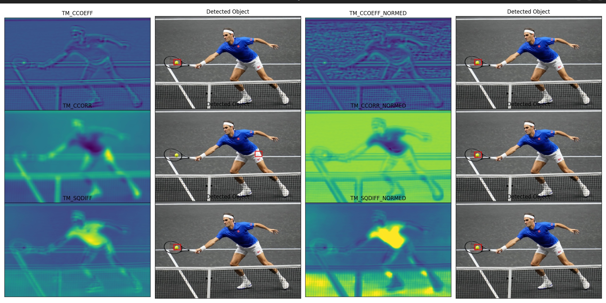
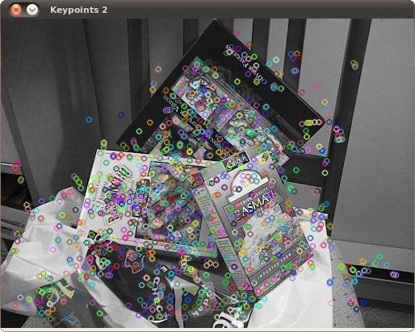

# Основы визуальной навигации.

Вы уже знакомы с базовыми принципами и некоторыми особенностями работы систем технического зрения. В этой теме вы погрузитесь в основы визуальной навигации и на практике рассмотрите работу некоторых систем.
Обратите внимание на диаграмму ниже. В ней указано много вариантов визуальной навигации, в том числе оптический поток, реперные маркеры, SLAM-системы, и некоторые популярные технологии.


<p align="center">
    <strong>Источник: </strong> Михаил Колодочка
</p>

Введение по системам визуальной навигации

Системы визуальной навигации стали ключевым компонентом в современных технологиях: от робототехники до автономных транспортных средств и БЛА. Благодаря им устройства ориентируются в пространстве по визуальным данным, то есть по изображениям с видеокамер.
Существует множество методов для анализа движения на основе изображений. Широко распространены способы, которые основаны на корреляции изображений, поиске и анализе характерных точек, анализе изображений с помощью ИИ и прочем.


# Первая программа на OPENCV

Для начала рассмотрим простую программу с использованием OpenCV, которая захватывает изображения и выводит текст на экран.


```python
# Импортируем необходимые библиотеки
import cv2

# Инициализируем камеру. 0 означает, что мы используем стандартную камеру устройства.
# Вместо 0 можно указать путь к любому файлу например /dev/v4l/by-id/... или /home/user/my_video.mp4
# Если 0 не подойдет, попробуйте другие источники или снимите видео если у вас нет камеры
cap = cv2.VideoCapture(0)

# Проверяем, инициализирована ли камера успешно
if not cap.isOpened():
    print("Error: camera not found.")
    exit()

while cap.isOpened():
    # Читаем кадр из видеопотока
    ret, frame = cap.read()

    # Проверяем, прочитан ли кадр успешно
    if not ret:
        print("Error: video frame read error.")
        break

    # Добавляем текст на картинку
    cv2.putText(frame, 'Hello, uav programming!', (50, 50), cv2.FONT_HERSHEY_SIMPLEX, 1, (0, 255, 0), 2, cv2.LINE_AA)

    # Отображаем картинку
    cv2.imshow('camera', frame)

    # Если пользователь нажмет клавишу 'q', выходим из цикла
    if cv2.waitKey(1) & 0xFF == ord('q'):
        break

# Освобождаем ресурсы и закрываем все окна
cap.release()
cv2.destroyAllWindows()
```

В данном примере Вы видите характерный цикл в котором происходит обработка изображения.
Наличие такого цикла в том или ином виде характерно почти для всех программ,
где происходит обработка видео. Основные действия с изображением ,
как правило, происходят внутри этого цикла.

Данный код также можно найти в примерах [scripts/examples/show_image.py](../scripts/examples/show_image.py)

## Рекомендации к написанию кода с использованием Opencv

Рассмотрим несколько основных правил для разработки программ с применением OpenCV. Большинство рекомендаций распространяется на написание практически любого кода.

- Перед созданием программы важно поставить чёткие цели и определить, что она должна делать. Обозначьте диапазон допустимых требований: скорость обработки, точность, время на разработку и прочее.

- Нарисуйте блок-схему работы алгоритма, опишите, что будет происходить с изображением на каждом шаге. Например, схема может быть такой:


Например: 

<p align="center">
    <strong>Источник: </strong> Михаил Колодочка
</p>

- Добавьте к коду больше тестов и проверок. Не пренебрегайте обработкой исключений. Чем сложнее проект, тем тяжелее будет сохранить стабильность работы программы. Распишите сценарии применения системы, снимите фото и видео для тестов согласно сценариям. Напишите тесты программы, используя тестовые фото и видео. Применяйте симуляторы и реальные тесты. Постарайтесь сделать тесты максимально полными: иногда даже незначительные изменения в проекте приводят к сбоям.

- Не пытайтесь добавить в программу много функционала. Лучше разбить её на отдельные модули (ноды в ROS). Например, одна программа может распознавать дефекты, а другая — заниматься оптической навигацией. Нарисуйте программу в рамках всей системы, разберитесь с форматом взаимодействия, входными и выходными данными.


<p align="center">
    <strong>Источник: </strong> Михаил Колодочка
</p>

- Внимательно проверяйте документацию на используемые библиотеки. Если требуемого функционала нет, посмотрите, можно ли скорректировать исходный код под вашу задачу.


- Регулярно изучайте новые технологии и алгоритмы в области, так как техническое зрение развивается постоянно. Так вы сможете создавать более продвинутые и эффективные программы.


- Используйте систему контроля версий **Git**, чтобы отслеживать изменения в коде, качественно вести работу и удобно взаимодействовать с другими разработчиками. Git стоит применять даже для разработки индивидуальных или учебных проектов. Аккуратный подход к разработке — залог создания качественного ПО.


- Пишите документацию по проекту, как минимум порядок сборки и запуска, и диаграмму работы программы. Умение писать качественную и понятную документацию — ключевой навык на работе. Обязательно оформляйте **README**: описание полезно для индивидуальных и учебных проектов.

---
В этой теме вы разобрали краткую инструкцию по созданию программ для навигации с использованием OpenCV. Подробнее ознакомиться с возможностями библиотеки вы можете в документации к ней и в специализированной литературе. Ссылки на дополнительные ресурсы вы найдете в разделе [полезные ссылки](#полезные-ссылки).

---
# Корреляционные системы

**Корреляционные системы** — один из основных методов визуальной навигации. Они основаны на вычислении корреляции между последовательными кадрами изображения: это позволяет определить движения или изменения в сцене. Например, эти методы часто используют, чтобы выявить оптический поток, следить за объектами и искать их на картинке.


Принципы работы корреляционных систем просты, а их основное преимущество заключается в способности быстро и точно определять мелкие движения на изображении. Тем не менее могут возникать проблемы из-за больших перепадов яркости, сложных текстур и размытия изображения.


## Как работают корреляционные алгоритмы

Корреляционные алгоритмы появились давно. Их концепция проста: в основе лежит идея сравнения двух изображений или их частей для определения степени схожести.
Рассмотрим базовый принцип работы таких алгоритмов. Искомый шаблон — это изображение меньше исходного, которое постоянно сдвигается на некоторый шаг, как показано ниже.


<p align="center">
    <strong>Источник: </strong> Михаил Колодочка
</p>


На каждом шаге шаблон вычитается из исходного изображения при помощи различных алгоритмов. Рассмотрим наиболее простой.


### Средний модуль разности (SAD - Sum of Absolute Differences)

Наиболее простой с вычислительной точки зрения алгоритм. В opencv его реализацию можно
найти в методе `cv2.absdiff`

**$$SAD=\sum_{i,j} |I_1(i,j) - I_2(i,j)|$$**

В данном случае $I_1$ и  $I_2$ это пара исходных изображений одинакового размера. 

Значение SAD вычисляют из абсолютной разницы между соответствующими пикселями двух блоков и суммирования разностей. В этом случае с каждым сдвигом мы получаем новое значение SAD. Чем оно меньше, тем выше сходство между блоками. 

Можно получить подобный результат. На изображении слева наиболее светлые области будут соответствовать меньшим значениям SAD, а тёмные — большим.


<p align="center">
    <strong>Источник: </strong> Михаил Колодочка
</p>

Алгоритм хорошо определил положение головы волка в кадре. Эта область выглядит как яркое белое пятно.

Взглянем на еще несколько популярных аогоритмов:

### Сумма квадратов разностей (SSD - Sum of Squared Differences)

В **OpenCV** сумму квадратов разностей в OpenCV называют **SQDIFF**. Вычисления в этом методе сложнее, чем в **SAD**.

**$$SSD = \sum_{i,j}(I_1(i,j) - I_2(i,j))^2$$**

Тут также $I_1$ и  $I_2$ это пара исходных изображений одинакового размера. 

Благодаря применению квадрата вместо модуля алгоритм более резко реагирует на различия между изображениями. Это увеличивает робастность. Квадрата даёт маленькие значения только вблизи наилучшего совпадения, что снижает вероятность ложных срабатываний.


### Нормализованная кросс-корреляция (NCC - Normalized Cross-Correlation)

В свою очередь если посмотреть на `NCC`, сразу можно отметить повышенную вычислительную сложность алгоритма. В OpenCV его можно найти под названием `CCORR_NORMED`.

**$$NCC = \frac{\sum_{i,j}(I_1(i,j)-\mu_1)(I_2(i,j)-\mu_2)}{\sqrt{(I_1(i,j)-\mu_1)^2 \sum_{i,j}(I_2(i,j)-\mu_2)^2}}$$**

где $I_1, I_2$ изображения как и ранее, а $\mu_1, \mu_2$ средние значения этих изображений.

**NCC** учитывает стандартное отклонение и среднее значение изображений. Этот алгоритм нормализует изображение по уровню интенсивности, что повышает его устойчивость к изменениям освещённости.

## Корреляционные алгоритмы на python

Используем рассмотренные алгоритмы и напишем программу, которая ищет заданный шаблон на изображении.

В качестве исходного будем использовать такое изображение: 

<p align="center">
    <strong>Источник: </strong> https://encrypted-tbn3.gstatic.com/images?q=tbn:ANd9GcRn1y2y9dtjk2dFH9BbVYftoeEI4TtjHoH22GQD9mNEgYIxlbVz
</p>

В качестве шаблона возьмём изображение теннисного мяча: 

<p align="center">
    <strong>Источник: </strong> https://encrypted-tbn3.gstatic.com/images?q=tbn:ANd9GcRn1y2y9dtjk2dFH9BbVYftoeEI4TtjHoH22GQD9mNEgYIxlbVz
</p>

Посмотрим на работу корреляционных методов, доступных в opencv,
чтобы лучше представлять как они работают:

```python
import cv2
import numpy as np
from matplotlib import pyplot as plt

# Загрузка исходного изображения
img = cv2.imread('../../.img/tennis.jpg')
assert img is not None, "File could not be read, check with os.path.exists()"
img2 = img.copy()

# Загрузка шаблона
template = cv2.imread('../../.img/ball.jpg')
assert template is not None, "File could not be read, check with os.path.exists()"

# Получение размеров шаблона
w, h = template.shape[0:2]

# Список методов для сравнения
methods = ['cv2.TM_CCOEFF', 'cv2.TM_CCOEFF_NORMED', 'cv2.TM_CCORR',
           'cv2.TM_CCORR_NORMED', 'cv2.TM_SQDIFF', 'cv2.TM_SQDIFF_NORMED']

# Создание фигуры для вывода всех изображений на одном графике
plt.figure(figsize=(20, 18))

for idx, meth in enumerate(methods, 1):
    img = img2.copy()
    method = eval(meth)

    # Применение метода сопоставления шаблона
    res = cv2.matchTemplate(img, template, method)
    min_val, max_val, min_loc, max_loc = cv2.minMaxLoc(res)

    # Выбор координат для рисования прямоугольника
    if method in [cv2.TM_SQDIFF, cv2.TM_SQDIFF_NORMED]:
        top_left = min_loc
    else:
        top_left = max_loc
    bottom_right = (top_left[0] + w, top_left[1] + h)

    # Рисование красного прямоугольника вокруг найденного объекта
    cv2.rectangle(img, top_left, bottom_right, (0, 0, 255), 8)

    # Вывод результатов
    plt.subplot(3, 4, idx*2-1), plt.imshow(res, cmap='viridis')
    plt.title(meth.split('.')[-1]), plt.xticks([]), plt.yticks([])
    plt.subplot(3, 4, idx*2), plt.imshow(cv2.cvtColor(img, cv2.COLOR_BGR2RGB))
    plt.title('Detected Object'), plt.xticks([]), plt.yticks([])

plt.tight_layout()
plt.show()
```

В результате работы программы должна получиться следующая картина:

<p align="center">
    <strong>Источник: </strong> Михаил Колодочка
</p>

С заданием не справился только один алгоритм. В остальных случаях чётко виден экстремум (чёрное или белое пятно) в области, которая соответствует искомой.

## Слежение за объектом на основе корреляции

Рассмотрим один из наиболее популярных кейсов применения корреляционных алгоритмов, а именно **слежение за объектом**.

В файле [object_tracking.py](../scripts/examples/object_tracking.py)
представлена программа осуществляющая слежение за выделенным объектом.

Результат работы программы с тестовым видео:

<p align="center">
    <strong>Источник: </strong> Михаил Колодочка
</p>


Найти исходное видео можно по [ссылке](https://drive.google.com/file/d/11T0yNd6txdg6PSeiLHIxdMySH72ELiRM/view?usp=drive_link)

Идея стандартной системы слежения за объектом проста.

<p align="center">
    <strong>Источник: </strong> Михаил Колодочка
</p>


В качестве визуализации использованы два прямоугольника. Малый красный обозначает зону интереса, за которой происходит слежение. Большой зелёный — зону поиска, внутри которой ищут зоны интереса. Зона поиска позволяет искать объект внутри малой зоны, а не во всём изображении. Такой подход снижает вероятность ложных срабатываний. Если объект будет двигаться быстро и выйдет из зоны в пределах времени обновления кадра, то будет потерян. Предложенный пример не совершенен. Более устойчивые алгоритмы могут менять зону поиска с учётом скорости объекта в кадре, обновлять зону интереса с учётом изменения масштаба объекта в кадре и прочее.
 


## Оптический поток с использованием методов корреляции

Идею зон интереса и поиска можно использовать, чтобы определить движение изображения. Пример такой программы есть в файле [block_matching_flow.py](../scripts/examples/block_matching_flow.py)

Изображение разбивают на несколько **субпикселей**, привязанных к координатам. Для каждого субпикселя определяют смещение в координатах изображения. После этого информацию со всех субпикселей можно усреднить или отфильтровать. Интегрируя данные о сдвиге изображения, можно получить траекторию движения в пикселях.

**Пример работы программы.**


<p align="center">
    <strong>Источник: </strong> Михаил Колодочка
</p>

Найти исходное видео можно по [ссылке](https://drive.google.com/file/d/1BOA8KTHIiIR-k9oTatTwEfYwC2wJ9oPH/view?usp=drive_link)

Чтобы запустить программу, можно воспользоваться командой:


```bash
python scripts/examples/block_matching_flow.py --video_source=path_to_your_video.mp4
```

## Оптический поток на основе алгоритма фазовой корреляции

Помимо классических алгоритмов, существует ещё один популярный подход — применение спектральных характеристик для анализа изображения. Алгоритмы на основе анализа фазы изображений позволяют определять их смещение, находить дефекты, улучшать или сжимать исходные изображения и так далее. Рассмотрим использование фазовой корреляции.


В методах фазовой корреляции содержание изображения анализируют при помощи спектральных характеристик. Фазовая корреляция — техника, которая определяет смещение между двумя изображениями при помощи преобразования Фурье. Этот метод позволяет выявить небольшие смещения, которые трудно обнаружить с помощью других способов.


Вы можете ознакомиться с примером оптического потока на основе фазовой корреляции в  файле
[phase_corr_flow.py](../scripts/examples/phase_corr_flow.py)

Пример запуска программы:

```bash
python scripts/examples/phase_corr_flow.py --video_source=path_to_your_video.mp4
```

**Пример работы программы**


<p align="center">
    <strong>Источник: </strong> Михаил Колодочка
</p>

Результат этого метода похож на пример прошлой программы.

Повторим формулы пересчёта оптического потока из пикселей в реальную скорость и связанные с этим проблемы. Подробнее о них мы говорили в видео.


<p align="center">
    <strong>Источник: </strong> [ссылка](https://www.bitcraze.io/documentation/repository/crazyflie-firmware/master/functional-areas/sensor-to-control/state_estimators/)
</p>

В большинстве автопилотов расчёт встроен в фильтр Калмана, который оценивает положение БЛА, поэтому обычно достаточно передать величину оптического потока.


Вы можете ознакомиться с исходным видео по [ссылке](https://drive.google.com/file/d/1BOA8KTHIiIR-k9oTatTwEfYwC2wJ9oPH/view?usp=drive_link)


# Визуальные ориентиры


<p align="center">
    <strong>Источник: </strong> Михаил Колодочка
</p>


В видео вы ознакомились с особенностями применения технологии реперныx маркеров и с примером работы алгоритма aruco. Сейчас вам предстоит на практике разобрать использование реперных маркеров для навигации в пространстве.

Рассмотрим программу, которая определяет положение камеры относительно маркера
[single_aruco.py](../scripts/examples/single_aruco.py).


<p align="center">
    <strong>Источник: </strong> Михаил Колодочка
</p>


Применения одного маркера ограничивает область полёта достаточно, поэтому часто создают массивы маркеров, которые покрывают нужную зону.

Используем скрипт для генерации поля реперных маркеров [board_generator.py](../scripts/board_generator.py)

```bash
python scripts/board_generator.py --output_filename=my_aruco.png --markersX=4 --markersY=4
```

В результате получим следующее поле маркеров: 

<p align="center">
    <strong>Источник: </strong> Михаил Колодочка
</p>

Рассмотрим программу, позволяющую осуществлять навигацию на основе полей _aruco_ маркеров 
[aruco_board.py](../scripts/examples/aruco_board.py)

В результате получим следующую картину:

<p align="center">
    <strong>Источник: </strong> Михаил Колодочка
</p>

Оценить своё положение легко вне зависимости от положения камеры над доской.

Тем не менее у такого подхода есть свои минусы. Все реперные маркеры в поле имеют одинаковый размер, поэтому диапазон рабочих высот ограничен. Из-за этого аппарат не может летать слишком близко или слишком далеко.
Такую проблему решают более сложные подходы. Например,
[технология](https://www.uco.es/investiga/grupos/ava/portfolio/fractal-markers/) реперных маркеров с фрактальной, самоподобной структурой.


<p align="center">
    <strong>Источник: </strong> https://www.uco.es/investiga/grupos/ava/portfolio/fractal-markers/
</p>

# Выделение и анализ признаков

Вы уже рассмотрели класс корреляционно-экстремальных алгоритмов (КЭА): он позволяет определить смещение аппарата между кадрами изображения, чтобы получить информацию о движении БЛА на основе данных камеры. Важно учитывать, что КЭА может допускать аномальные ошибки и неустойчив к геометрической изменчивости изображений при работе в реальных условиях. А ещё при КЭА необходимо сохранять и обновлять зону интереса (эталона). 
Специалисты хотели получить более надёжное обнаружение в реальной обстановке, поэтому перешли на алгоритмы структурного анализа данных изображений. 
Анализ признаков в изображениях использует выделенные характеристики или признаки изображения, чтобы определить смещения и движения. Этот подход считают более точным, чем КЭА. Ведь он лучше подходит для реальных условий, когда изображения меняются из-за разного освещения, поворотов и масштабирования.

В анализе изображений часто используют угловые, или ключевые, точки.

**Угловые точки** - имеют уникальные характеристики, что позволяет легко находить их на разных изображениях одной сцены. Их часто выбирают на основе устойчивости к изменениям: поворотам, масштабированию и разному освещению.


**Примеры нахождения угловых точек **


<p align="center">
    <strong>Источник: </strong> https://docs.opencv.org/3.4/d5/dde/tutorial_feature_description.html
</p>



<p align="center">
    <strong>Источник: </strong> https://docs.opencv.org/3.4/d5/dde/tutorial_feature_description.html
</p>

Cопоставление изображений на основе анализа признаков:


<p align="center">
    <strong>Источник: </strong> https://docs.opencv.org/3.4/d5/dde/tutorial_feature_description.html
</p>


Оригинальный [пример из документации](https://docs.opencv.org/3.4/d5/dde/tutorial_feature_description.html)
.

Помимо угловых точек, можно использовать и другие признаки для анализа изображений:

* контуры позволяют находить и отслеживать объекты на изображении;
* текстуры — классифицировать объекты на основе их поверхностных характеристик;
* цветовые гистограммы — сегментировать изображение на основе его цвета.

Сочетая эти признаки с алгоритмами машинного обучения и компьютерного зрения, можно значительно повысить точность и надёжность анализа изображений, особенно в реальных условиях.

Тема анализа признаков достаточно обширна поэтому рекомендуется ознакомиться с
[документацией](https://docs.opencv.org/3.4/d4/d7d/tutorial_harris_detector.html)

Рассмотрим принципы работы современной системы автономной навигации — **SLAM**.

# Основы работы SLAM

**SLAM (Simultaneous Localization and Mapping)** — это метод, при помощи которого робот или автономное транспортное средство строит карту окружающей среды и одновременно определяет свою позицию на ней. Его широко используют в разных областях: от робототехники и автономных транспортных средств до дополненной и виртуальной реальности.


Обобщенную диаграмму работы SLAM Вы можете видеть ниже:

<p align="center">
    <strong>Источник: </strong> Михаил Колодочка
</p>


- `Обнаружение признаков`.
Сначала система SLAM определяет признаки в окружающей среде, которые можно использовать для навигации. Например, угловые точки, контуры, текстуры или другие характеристики, которые легко обнаруживать и отслеживать.


- `Оценка движения`.
 Затем система SLAM оценивает своё движение на основе изменений в обнаруженных признаках. Например, при помощи оптического потока, фильтров Калмана или фильтров частиц.

- `Построение карты`.
 Параллельно с оценкой движения система SLAM строит карту окружающей среды на основе обнаруженных признаков. Например, при помощи триангуляции, облака точек или сетки занятости.


- `Определение положения`.
По построенной карте и оценке движения система SLAM определяет свою позицию на карте. Например, при помощи сопоставления признаков и карт, а также фильтрации. 


- `Обновление карты и положения.` Во время работы SLAM признаки в карте регулярно обновляются в зависимости от положения аппарата. Так навигация становится более точной и надёжной. 


**_SLAM_** — это сложный метод, который активно развивается. Для него необходима комбинация алгоритмов компьютерного зрения, машинного обучения и робототехники. 


## Популярные алгоритмы

Рассмотрим популярные открытые алгоритмы Visual SLAM и их основные характеристики:


- **ORB-SLAM (и ORB-SLAM2, ORB-SLAM3):**
Основные методы и алгоритмы: Характерные точки ORB (Oriented FAST and Rotated BRIEF), Bundle Adjustment для оптимизации карты и траектории.
**Камеры**: Монокулярные, стереокамеры и RGB-D камеры.
**Ссылка**: [ORB-SLAM GitHub](https://github.com/UZ-SLAMLab/ORB_SLAM3)

- **LSD-SLAM (Large-Scale Direct Monocular SLAM):**
Основные методы и алгоритмы: Сопоставление изображений в качестве признаков, плотный оптический поток, глобальная оптимизация карты и траектории.
**Камеры**: Монокулярные камеры.
**Ссылка**: [LSD-SLAM GitHub](https://github.com/tum-vision/lsd_slam)


- **S-PTAM (Stereo Parallel Tracking and Mapping):**
Основные методы и алгоритмы: Bundle Adjustment. Классические корреляционные алгоритмы.
**Камеры**: Стереокамеры.
**Ссылка**: [S-PTAM GitHub](https://github.com/lrse/sptam)


- **DT-SLAM (Dense Tracking and Mapping):**
Основные методы и алгоритмы: Плотное отслеживание и построение карты, многократное сопоставление признаков.
**Камеры**: Монокулярные камеры.
**Ссылка**: [DT-SLAM GitHub](https://github.com/plumonito/dtslam)

- **RTAB-Map (Real-Time Appearance-Based Mapping):**
Основные методы и алгоритмы: Визуальная одометрия, Обнаружение замыкания карты
**Камеры**: RGB-D камеры, стереокамеры.
**Ссылка**: [RTAB-Map GitHub](https://github.com/introlab/rtabmap)

Эти алгоритмы используют разные методы, например извлечение и сопоставление признаков, прямое изображение, плотные методы оптического потока (**dense optical flow**), оптимизацию карты и траектории, визуальную одометрию и обнаружение замыкания карты (если система поймёт, что круг пройден, то скорректирует карту). Также они работают с разными типами камер, в том числе с монокулярными, стереокамерами и RGB-D-камерами.

# Полезные ссылки

- [Алгоритм оценки положения и ориентации на основе фазовой корреляции](https://sthoduka.github.io/imreg_fmt/docs/overall-pipeline/)

- [Учебник по SLAM](https://github.com/gaoxiang12/slambook-en)

- [Примеры работы с признаками](https://www.geeksforgeeks.org/line-detection-python-opencv-houghline-method/?ref=lbp)